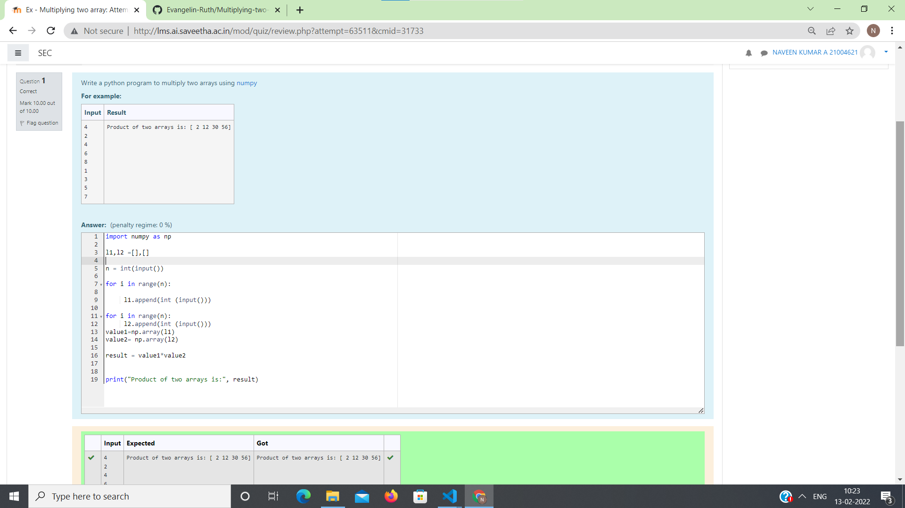

# Multiplying-two-matrix

## AIM:
To write a program to perform Multiplying-two-matrix using python programming.
## ALGORITHM:

### Step 1:
Import Numpy module as np.
### Step 2:
Create empty lists.
### Step 3:
Get input from the user for number of rows and columns.
### Step 4:
Use nested lists to append list.
### Step 5:
Use nested lists to append list.

## PROGRAM: 
```
##Developed by:A NAVEEN KUMAR
##Register no:21004621
import numpy as np

l1,l2 =[],[]

n = int(input())

for i in range(n):

     l1.append(int (input()))

for i in range(n):
     l2.append(int (input()))
value1=np.array(l1)
value2= np.array(l2)

result = value1*value2


print("Product of two arrays is:", result)
```
## OUTPUT:

## RESULT:

Thus the program is written to perform Multiplying-two-matrix using python programming